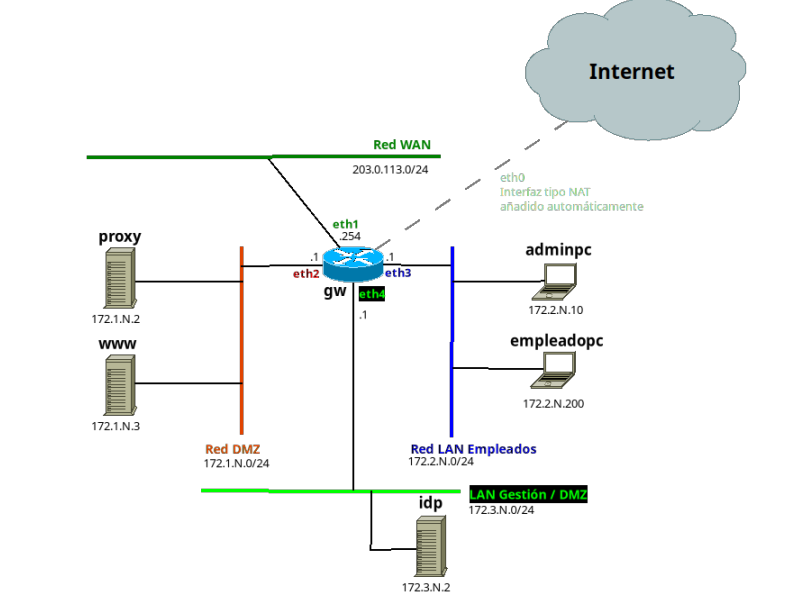

# Proyecto SAD


##  1. Gateway / Enrutador (`gw`)
* **Sistema Operativo:** Ubuntu 24.04
* **Función:** Encaminamiento de tráfico entre subredes, cortafuegos (iptables/nftables) y salida a Internet mediante NAT.
* **Interfaces de Red:**
  * `eth0`: Conexión NAT por defecto para acceso a Internet.
  * `eth1`: Interfaz Bridge a la red física.
  * `eth2` (DMZ): `172.1.02.1`
  * `eth3` (LAN Empleados): `172.2.02.1`
  * `eth4` (Gestión / Intranet): `172.3.02.1`

## 2. Zona Desmilitarizada — DMZ (`172.1.02.0/24`)
Destinada a albergar servicios públicos o intermediarios de red.
* **`proxy`** (`172.1.02.2`)
  * **SO:** Ubuntu 24.04
  * **Función:** Servidor Proxy HTTP (Squid) para el control y filtrado de navegación de los clientes.
* **`www`** (`172.1.02.3`)
  * **SO:** Alpine Linux
  * **Función:** Servidor Web para la publicación de servicios externos y entornos de prueba (DVWA/Pentesting).

## 3. Red Intranet / Gestión (`172.3.02.0/24`)
Zona aislada sin acceso directo desde el exterior, orientada a servicios centrales de infraestructura.
* **`idp`** (`172.3.02.2`)
  * **SO:** Ubuntu 24.04
  * **Función:** Proveedor de identidades (Servidor OpenLDAP).

## 4. LAN de Empleados (172.2.2.0/24)
Zona orientada a las estaciones de trabajo de los usuarios finales y administradores.
* **`adminpc`** (`172.2.02.10`)
  * **SO:** Alpine Linux
  * **Función:** Equipo de administración para el despliegue de scripts y gestión SSH de la red.
* **`empleadopc`** (`172.2.02.200`)
  * **SO:** Alpine Linux
  * **Función:** Estación de trabajo para usuarios estándar.

## Intrucciones para el despliegue

### 2.1. Requisitos previos

Tener instalado lo siguiente:

- Git
- Virtualbox
- Vagrant

### 2.2. Despliegue

1. Clonar este repositorio:

```bash
git clone [https://github.com/pes130/SAD-PROYECTO-2026-26-solucion.git](https://github.com/pes130/SAD-PROYECTO-2026-26-solucion.git)
```
2. Levantar con vagrant

```bash
$ cd SAD-PROYECTO-2026-26-solucion
$ vagrant up
```

3. Una vez levantado, comprobamos el estado de las máquinas con:

```bash
$ vagrant status
```
4. Y accedemos a las máquinas con `vagrant ssh måquina`. Ej. para acceder a www: 

```bash
$ vagrant ssh www
```
